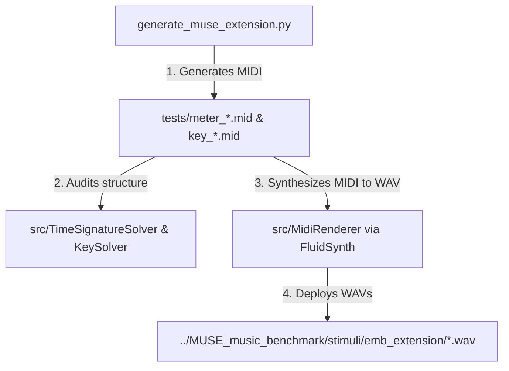

# Extended Music Benchmarks (EMB)

Extended Music Benchmarks (`emb`) is a toolkit designed for **programmatic musical stimulus generation** and **algorithmic music analysis**. It acts as the backend creation engine for extending the `MUSE_music_benchmark` dataset with complex, verified, and dynamically generated audio trials.

---

## 1. Core Architecture

The repository is built around expert algorithmic solvers and lightweight rendering utilities:

*   **`TimeSignatureSolver` (`./src/time_signature_solver.py`):** Uses Inter-Onset Interval (IOI) analysis and relative velocity note accentuation to detect meter and identify beat groupings, capable of detecting transitions over time even when MIDI metadata is absent.
*   **`KeySolver` (`./src/key_solver.py`):** Implements the Krumhansl-Schmuckler key-finding algorithm with Krumhansl-Kessler pitch profiles. Evaluates pitch class distribution weighted by note duration and velocity using Pearson correlation, allowing for sliding-window tracking of key modulations.
*   **`BeatSolver` (`./src/beat_solver.py`):** Extracts rhythmic pulse, tempo changes, and downbeat alignments.
*   **`MidiRenderer` (`./src/midi_renderer.py`):** A portable MIDI-to-WAV wave synthesizer. It provides a pure-sine fallback synth and a high-fidelity **FluidSynth** integration that calls system-level binaries with default SoundFonts (e.g., `FluidR3_GM.sf2`) to output realistic instrument waves (like a grand piano).

---

## 2. Stimulus Generation & Integration with MUSE

Rather than maintaining a static, manually labeled set of recordings, `emb` is used to create and verify new test sets that target **temporal localization** (noticing *when* a shift occurs).



### Flow of the Extension Pipeline
1.  **Generation (`./generate_muse_extension.py`):** Programmatically writes MIDI files with precise structural changes (e.g. meter shifts from 4/4 to 3/4, or key modulations from C Major to G Major) occurring at specific bars (e.g., bar 5 for early shifts, bar 12 for late shifts).
2.  **Algorithmic Verification:** Runs `TimeSignatureSolver` and `KeySolver` on the MIDI files to confirm that the musical accents and harmonic progressions are mathematically distinct.
3.  **Rendering & Deployment:** Uses `MidiRenderer` to render the verified MIDIs into piano WAV files using system FluidSynth. The output audio is deployed directly to the sibling MUSE repository directory at `../MUSE_music_benchmark/stimuli/emb_extension/`.
4.  **LLM Evaluation:** Gemini/Qwen runners in the MUSE repository upload these `.wav` files and evaluate model responses against the verified solver ground truth.

---

## 3. Repository Layout

```text
src/
  ├── key_solver.py            # Krumhansl-Schmuckler key-finding
  ├── time_signature_solver.py # Accent & IOI-based meter analysis
  ├── beat_solver.py           # Pulse tracking
  └── midi_renderer.py         # Wave synthesizer (FluidSynth backend)
tests/
  ├── *.mid                    # Source MIDI files (e.g., meter_shift_early.mid)
  ├── test_*.py                # Pytest unit tests for solvers and rendering
  └── run_*.py                 # Helper analysis and test scripts
generate_muse_extension.py     # Main stimulus generator and MUSE deployer
requirements.txt               # Project dependencies
```

---

## 4. Setup & Running Tests

### Installation
Ensure that `fluidsynth` and its default SoundFonts (such as `fluid-soundfont-gm`) are installed on your operating system (e.g. `sudo apt install fluidsynth fluid-soundfont-gm` on Ubuntu/Debian).

Then set up the Python virtual environment:
```bash
python3 -m venv .venv
source .venv/bin/activate
pip install -r requirements.txt
```

### Running the Tests
To verify that the solvers are working properly, run the test suite:
```bash
pytest
```

### Regenerating and Deploying MUSE Stimuli
To regenerate the MIDI test assets, run the verification solvers, and output updated WAV files into the MUSE benchmark stimuli directory:
```bash
python generate_muse_extension.py
```
*(This assumes the `MUSE_music_benchmark` folder is cloned as a sibling directory at `../MUSE_music_benchmark`.)*
